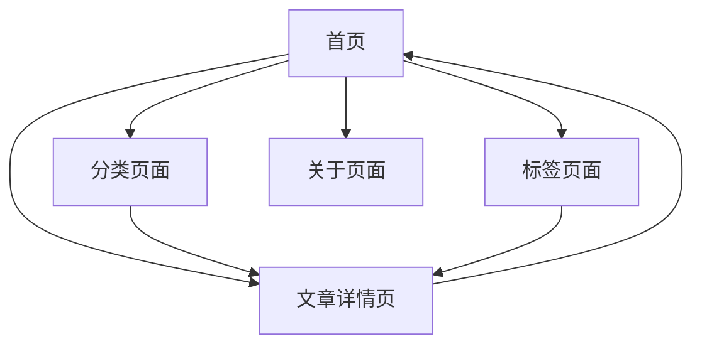

# CsBlog 现代化动漫博客产品需求文档

## 1. 产品概述

CsBlog 是一个融合技术分享与二次元文化的现代化个人博客平台，采用 GitHub 风格的暗色主题设计，专注于为技术爱好者和动漫文化爱好者提供优质的内容展示和阅读体验。

产品旨在打造一个独特的个人品牌形象，通过精美的视觉设计和流畅的用户体验，展示技术文章、动漫分析和个人见解，建立技术与二次元文化的完美结合。

## 2. 核心功能

### 2.1 用户角色

| 角色 | 注册方式 | 核心权限 |
|------|----------|----------|
| 默认用户 | 直接访问 | 可浏览所有内容、搜索文章、查看标签分类 |
| 博主 | 系统管理员 | 可发布文章、管理内容、查看统计数据 |

### 2.2 功能模块

我们的博客需求包含以下主要页面：
1. **首页**：顶部导航栏、特色文章横幅、文章列表、右侧个人信息卡片
2. **分类页面**：按动漫、技术等分类展示文章
3. **标签页面**：标签云展示和按标签筛选文章
4. **文章详情页**：完整文章内容展示和阅读体验
5. **关于页面**：个人介绍和联系方式

### 2.3 页面详情

| 页面名称 | 模块名称 | 功能描述 |
|----------|----------|----------|
| 首页 | 顶部导航栏 | 显示 Logo、博客标题、导航菜单（首页、分类、标签、关于）、搜索框 |
| 首页 | 特色文章横幅 | 展示精选文章，包含动漫主题图片、文章标题、摘要、发布日期、标签 |
| 首页 | 文章列表 | 卡片式布局展示文章，包含缩略图、标题、摘要、发布日期、互动数据 |
| 首页 | 个人信息卡片 | 显示头像、姓名、简介、统计数据（文章数、关注者、关注中） |
| 首页 | 热门标签模块 | 展示热门标签云，支持点击跳转到标签页面 |
| 首页 | 社交链接模块 | 显示 GitHub、Twitter、Bilibili 等社交平台链接 |
| 分类页面 | 分类导航 | 按动漫、技术、分析等分类展示文章列表 |
| 标签页面 | 标签云 | 可视化展示所有标签，支持按标签筛选文章 |
| 文章详情页 | 文章内容 | 完整文章内容展示，包含标题、正文、代码高亮、图片展示 |
| 文章详情页 | 文章元信息 | 显示发布日期、分类、标签、阅读时间、互动数据 |
| 关于页面 | 个人介绍 | 详细的个人背景、技能、兴趣爱好介绍 |

## 3. 核心流程

**主要用户操作流程：**

用户访问博客首页，可以通过顶部导航栏浏览不同页面，在首页可以查看特色文章横幅了解精选内容，浏览文章列表获取更多文章，通过右侧个人信息卡片了解博主信息。用户可以点击文章标题进入详情页阅读完整内容，也可以通过标签和分类进行内容筛选。

**页面导航流程图：**

## 4. 用户界面设计

### 4.1 设计风格

- **主色调**：GitHub 风格暗色主题（#0d1117 主背景，#161b22 次要背景，#21262d 卡片背景）
- **强调色**：动漫主题色彩（#ff6b6b 海贼王红，#4ecdc4 EVA绿，#45b7d1 高达蓝）
- **按钮样式**：圆角矩形，支持悬停动画效果
- **字体**：系统默认字体栈，主标题 22px，正文 14px，辅助文字 12px
- **布局风格**：现代化卡片式设计，CSS Grid + Flexbox 响应式布局
- **图标风格**：简洁的 emoji 图标和几何图形装饰

### 4.2 页面设计概览

| 页面名称 | 模块名称 | UI 元素 |
|----------|----------|----------|
| 首页 | 顶部导航栏 | 固定定位，半透明背景，渐变边框，Logo 使用红色圆角矩形，导航按钮采用不同颜色边框 |
| 首页 | 特色文章横幅 | 大型卡片布局，左侧动漫主题图片区域，右侧文章信息，底部彩色标签 |
| 首页 | 文章列表 | 卡片式布局，左侧小图标，右侧文章信息，底部互动数据，悬停上浮效果 |
| 首页 | 个人信息卡片 | 圆形头像，渐变边框，统计数据三栏布局，社交链接按钮 |
| 首页 | 热门标签 | 彩色标签云，不同颜色区分不同类型，圆角边框设计 |

### 4.3 响应式设计

产品采用桌面优先的响应式设计，支持桌面端（1400px+）、平板端（768px-1024px）、移动端（<768px）三种布局。桌面端采用双栏布局，移动端自动切换为单栏堆叠布局，确保在所有设备上都有良好的阅读体验。